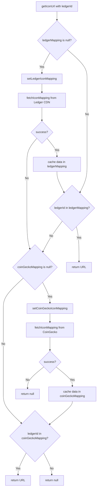

# @ledgerhq/crypto-icons

A package which provides a `<CryptoIcon />` component that can be consumed by Ledger applications in a React environment and used with a `ledgerId` to render icons.

## Installation

```bash
npm install @ledgerhq/crypto-icons
```

## Usage example

```JSX
import { CryptoIcon } from '@ledgerhq/crypto-icons';

const Page = () => {
  return (
    <>
      <CryptoIcon ledgerId="bitcoin" ticker="BTC" />
      <CryptoIcon ledgerId="ethereum" ticker="ETH" size="32px" />
      <CryptoIcon ledgerId="solana" ticker="SOL" size="48px" theme="light" />
      <CryptoIcon ledgerId="ethereum/erc20/usd_tether__erc20_" ticker="USDT" network="ethereum"/>
    </>
  )
}
```

## React Native Usage

The package supports React Native through platform-specific components and automatic resolution:

### Automatic Import (Recommended)

```JSX
import { CryptoIcon } from '@ledgerhq/crypto-icons';

const MyComponent = () => {
  return (
    <>
      <CryptoIcon ledgerId="bitcoin" ticker="BTC" size={32} />
      <CryptoIcon ledgerId="ethereum" ticker="ETH" size={48} theme="dark" />
      <CryptoIcon ledgerId="ethereum/erc20/usd_tether__erc20_" ticker="USDT" network="ethereum"/>
    </>
  )
}
```

### Explicit React Native Import

```JSX
import CryptoIcon from '@ledgerhq/crypto-icons/native';

const MyComponent = () => {
  return (
    <CryptoIcon ledgerId="bitcoin" ticker="BTC" size={32} theme="light" />
  )
}
```

## Icon sources

The component's primary source of icons is Ledger's CDN which contains the [assets](../assets/index.json) from this repository. It attempts to fetch a [mapping from Ledger's CDN](https://crypto-icons.ledger.com/index.json) and if the ledgerId that is passed in as a prop to the component is found, the URL for that key is used as the image source. You can see an up-to-date list of all available Ledger icons in this [Storybook](https://crypto-icons-storybook.pages.dev).

Otherwise, a request to the [Ledger mapping service](https://ledgerhq.atlassian.net/wiki/spaces/BE/pages/3973022073/Mapping+Service) is made to retrieve a [CoinGecko mapping](https://mapping-service.api.ledger.com/v1/coingecko/mapped-assets) as a fallback. If a match for an icon is found using the ledgerId then it is used as the image source.

If neither mapping has a match, a `<FallbackIcon />` component is returned with the first letter of the currency ticker as its content e.g. B for BTC.



## Contributing

Make sure you're in the correct directory:

```bash
cd lib
```

### Install dependencies

```bash
pnpm i
```

### Run tests

```bash
pnpm test
# or
pnpm test:watch # to run in watch mode
```

### Run storybook

```bash
# React Web Storybook
pnpm storybook:react

# React Native Storybook
pnpm storybook:native
```

### Lint

```bash
pnpm lint # to find issues
# or
pnpm lint:fix # to find and fix issues
```

### Build package with Rollup

```bash
pnpm build
```

### Test locally

Package can be tested locally with `pnpm-link` or `file:` protocol. Details can be found here: [https://pnpm.io/cli/link#whats-the-difference-between-pnpm-link-and-using-the-file-protocol](https://pnpm.io/cli/link#whats-the-difference-between-pnpm-link-and-using-the-file-protocol).

### Disclaimer

Some of the icons provided are trademarks: they are the property of their respective owners.
