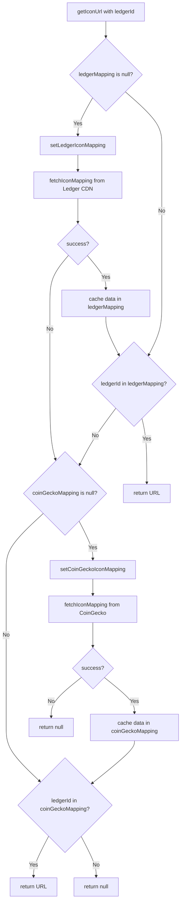

# @ledgerhq/crypto-icons

A package which provides a `<CryptoIcon />` component that can be consumed by Ledger applications in a React environment and used with a `ledgerId` to render icons.

## Installation

Get package source URL with Github API:

```bash
curl -H "Authorization: token <GITHUB_PAT_TOKEN>" -H "Accept: application/vnd.github.v3+json" -L https://npm.pkg.github.com/@ledgerhq%2fcrypto-icons | jq '.versions[].dist.tarball'
```

This will return URLs for all available package versions which can then be used in `package.json` e.g:

```bash
"@ledgerhq/crypto-icons": "https://npm.pkg.github.com/download/@ledgerhq/crypto-icons/1.0.1/8e6a0e1f4dd462745521dfaa729ae653a9c2950c"
```

To install the package you first need to [authenticate to the GitHub Packages registry](https://docs.github.com/en/packages/learn-github-packages/introduction-to-github-packages#authenticating-to-github-packages). This can be set in an `.npmrc` file in the root of your repository:

```bash
# .npmrc
//npm.pkg.github.com/:_authToken=${GITHUB_NPM_TOKEN}
```

### Locally

- Create a [Personal Access Token (Classic)](https://docs.github.com/en/authentication/keeping-your-account-and-data-secure/managing-your-personal-access-tokens#personal-access-tokens-classic) with a `read:packages` scope.
- Add a new variable `export GITHUB_NPM_TOKEN=<PAT_VALUE>` to your `~/.zshrc` or equivalent

### In a GitHub workflow

Set the variable in your workflow env setup as the [`GITHUB_TOKEN`](https://docs.github.com/en/actions/security-for-github-actions/security-guides/automatic-token-authentication#about-the-github_token-secret) secret:

```bash
env:
  GITHUB_NPM_TOKEN: ${{ secrets.GITHUB_TOKEN }}
```

## Usage example

```JSX
import { CryptoIcon } from '@ledgerhq/crypto-icons';

const Page = () => {
  return (
    <>
      <CryptoIcon ledgerId="bitcoin" ticker="BTC" />
      <CryptoIcon ledgerId="ethereum" ticker="ETH" size="32px" />
      <CryptoIcon ledgerId="solana" ticker="SOL" size="48px" theme="light" />
    </>
  )
}
```

## Icon sources

The component's primary source of icons is Ledger's CDN which contains the [assets](../assets/index.json) from this repository. It attempts to fetch a [mapping from Ledger's CDN](https://crypto-icons.ledger.com/index.json) and if the ledgerId that is passed in as a prop to the component is found, the URL for that key is used as the image source. You can see an up-to-date list of all available Ledger icons in this [Storybook](https://crypto-icons-storybook.pages.dev).

Otherwise, a request to the [Ledger mapping service](https://ledgerhq.atlassian.net/wiki/spaces/BE/pages/3973022073/Mapping+Service) is made to retrieve a [CoinGecko mapping](https://mapping-service.api.ledger.com/v1/coingecko/mapped-assets) as a fallback. If a match for an icon is found using the ledgerId then it is used as the image source.

If neither mapping has a match, a `<FallbackIcon />` component is returned with the first letter of the currency ticker as its content e.g. B for BTC.



## Contributing

Make sure you're in the correct directory:

```bash
cd lib
```

### Install dependencies

```bash
pnpm i
```

### Run tests

```bash
pnpm test
# or
pnpm test:watch # to run in watch mode
```

### Run storybook

```bash
pnpm storybook
```

### Lint

```bash
pnpm lint # to find issues
# or
pnpm lint:fix # to find and fix issues
```

### Build package with Rollup

```bash
pnpm build
```

### Test locally

Package can be tested locally with `pnpm-link` or `file:` protocol. Details can be found here: [https://pnpm.io/cli/link#whats-the-difference-between-pnpm-link-and-using-the-file-protocol](https://pnpm.io/cli/link#whats-the-difference-between-pnpm-link-and-using-the-file-protocol).

### Disclaimer

Some of the icons provided are trademarks: they are the property of their respective owners.
