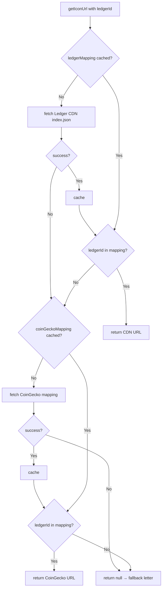

# @ledgerhq/crypto-icons

A React / React Native component that resolves crypto-currency icons from the Ledger CDN or CoinGecko and renders them using the [Lumen](https://github.com/LedgerHQ/lumen) design system.

> **v2.0.0 — breaking change.** This version replaces `styled-components` with Lumen components and introduces a revised prop API. See the [migration notes](#migrating-from-v1) below.

---

## Installation

```bash
# Package
npm install @ledgerhq/crypto-icons

# Required peer dependencies
npm install @ledgerhq/lumen-ui-react @ledgerhq/lumen-design-core   # React
npm install @ledgerhq/lumen-ui-rnative                              # React Native
```

> Lumen packages are hosted on the Ledger JFrog registry. Add the scope to your `.npmrc`:
> ```
> @ledgerhq:registry=https://jfrog.ledgerlabs.net/artifactory/api/npm/ldls-npm-prod-public/
> //jfrog.ledgerlabs.net/...:_authToken=${JFROG_TOKEN}
> ```

---

## Setup

### 1 — Tailwind (React web only)

Add the Lumen preset to your `tailwind.config`:

```ts
import { ledgerLivePreset } from '@ledgerhq/lumen-design-core';

export default {
  content: [
    './src/**/*.{ts,tsx}',
    './node_modules/@ledgerhq/lumen-ui-react/dist/**/*.{js,ts,jsx,tsx}',
  ],
  presets: [ledgerLivePreset],
};
```

### 2 — ThemeProvider (React & React Native)

Wrap your app root with Lumen's `ThemeProvider`. All Lumen components — including those used internally by `CryptoIcon` — throw without it.

```tsx
// React
import { ThemeProvider } from '@ledgerhq/lumen-ui-react';
import { ledgerLiveThemes } from '@ledgerhq/lumen-design-core';

<ThemeProvider themes={ledgerLiveThemes} colorScheme="system">
  <App />
</ThemeProvider>
```

```tsx
// React Native
import { ThemeProvider } from '@ledgerhq/lumen-ui-rnative';
import { ledgerLiveThemes } from '@ledgerhq/lumen-design-core';

<ThemeProvider themes={ledgerLiveThemes} colorScheme="light">
  <App />
</ThemeProvider>
```

---

## React usage

```tsx
import { CryptoIcon, type CryptoIconProps } from '@ledgerhq/crypto-icons';

<CryptoIcon ledgerId="bitcoin" ticker="BTC" size={56} />

<CryptoIcon
  ledgerId="ethereum/erc20/usdc"
  ticker="USDC"
  network="ethereum"
  badgePosition="bottom-end"
  size={56}
/>
```

### Props

| Prop | Type | Default | Description |
|---|---|---|---|
| `ledgerId` | `string` | — | Ledger internal currency identifier |
| `ticker` | `string` | — | Ticker symbol — first letter shown as fallback |
| `size` | `12\|16\|20\|24\|32\|40\|48\|56\|64` | `48` | Icon size in px |
| `shape` | `'circle'\|'square'` | `'circle'` | Icon shape |
| `network` | `string?` | — | Ledger ID of the chain for the badge overlay |
| `badgePosition` | `'top-start'\|'top-end'\|'bottom-start'\|'bottom-end'` | `'bottom-end'` | Badge corner |
| `alt` | `string?` | — | Accessibility label for the image |
| `testID` | `string?` | — | Forwarded as `data-testid` to the root element |

---

## React Native usage

Import from the `/native` sub-path. Metro reads the `react-native` field in `package.json` automatically; explicit imports also work.

```tsx
import CryptoIcon, { type CryptoIconProps } from '@ledgerhq/crypto-icons/native';

<CryptoIcon ledgerId="bitcoin" ticker="BTC" size={56} />
```

Props are identical to the React version. `testID` is forwarded as the native `testID` prop.

---

## With DotIcon (status badge)

Use Lumen's `DotIcon` to overlay a status indicator. Use `mediaImageDotSizeMap` (React) or `mediaImageDotIconSizeMap` (React Native) to automatically derive the correct badge size from the icon size.

```tsx
// React
import { CryptoIcon } from '@ledgerhq/crypto-icons';
import { DotIcon, mediaImageDotSizeMap } from '@ledgerhq/lumen-ui-react';
import { Check, Clock, Close } from '@ledgerhq/lumen-ui-react/symbols';

<DotIcon icon={Check} appearance="success" size={mediaImageDotSizeMap[56]}>
  <CryptoIcon ledgerId="bitcoin" ticker="BTC" size={56} />
</DotIcon>
```

```tsx
// React Native
import CryptoIcon from '@ledgerhq/crypto-icons/native';
import { DotIcon, mediaImageDotIconSizeMap } from '@ledgerhq/lumen-ui-rnative';
import { Check } from '@ledgerhq/lumen-ui-rnative/symbols';

<DotIcon icon={Check} appearance="success" size={mediaImageDotIconSizeMap[56]}>
  <CryptoIcon ledgerId="bitcoin" ticker="BTC" size={56} />
</DotIcon>
```

---

## Icon resolution

Icons are resolved in order:

1. **Ledger CDN** — fetches `https://crypto-icons.ledger.com/index.json` and looks up `ledgerId`.
2. **CoinGecko mapping** — fetches the [Ledger mapping service](https://mapping-service.api.ledger.com/v1/coingecko/mapped-assets) as a fallback.
3. **Letter fallback** — if neither source has a match, the first letter of `ticker` is shown inside a muted circle.


```mermaid
flowchart TD
  A[getIconUrl with ledgerId] --> B{ledgerMapping cached?}
  B -->|No| C[fetch Ledger CDN index.json] --> D{success?}
  D -->|Yes| E[cache] --> F
  D -->|No| G
  B -->|Yes| F{ledgerId in mapping?}
  F -->|Yes| H[return CDN URL]
  F -->|No| G{coinGeckoMapping cached?}
  G -->|No| I[fetch CoinGecko mapping] --> J{success?}
  J -->|Yes| K[cache] --> L
  J -->|No| M[return null → fallback letter]
  G -->|Yes| L{ledgerId in mapping?}
  L -->|Yes| N[return CoinGecko URL]
  L -->|No| M
```

---

## Migrating from v1

| v1 | v2 |
|---|---|
| `size="56px"` (string) | `size={56}` (number) |
| `theme="dark"` | removed — use Lumen `ThemeProvider` |
| `overridesRadius="16px"` | `shape="square"` |
| `ticker` optional | `ticker` **required** |
| `backgroundColor` (RN) | removed |
| Default shape: implicit circle | `shape='circle'` explicit default |

---

## Contributing

```bash
cd lib
pnpm i
```

### Development

```bash
pnpm dev:web       # watch & rebuild React bundle
pnpm dev:native    # watch & rebuild React Native bundle
```

### Tests & lint

```bash
pnpm test
pnpm lint
pnpm lint:fix
```

### Storybook

```bash
pnpm storybook:react    # port 6006
pnpm storybook:native   # port 6007
```

### Build

```bash
pnpm build         # both platforms
pnpm build:web     # React only
pnpm build:native  # React Native only
```

### Local development against another repo

Add to the consuming repo's root `package.json`:

```json
{
  "pnpm": {
    "overrides": {
      "@ledgerhq/crypto-icons": "file:../crypto-icons/lib"
    }
  }
}
```

Then `pnpm install` in the consuming repo. Run `pnpm dev:web` / `pnpm dev:native` in this repo to keep the build up to date.

### Adding new icons

1. **Prepare** — 144×144 px PNG, artwork filling the full canvas.
2. **Compress** — place in `/compress/`, run `pnpm compress`, collect output from `/compress/out/`.
3. **Move** — copy optimised PNGs into `/assets/`.
4. **Register** — add entries to `/assets/_record.json`.
5. **Index** — run `pnpm generate:index` to update `/assets/index.json`.
6. **Verify** — check the **All Ledger Icons** story in Storybook.

---

> Some icons provided are trademarks and are the property of their respective owners.
